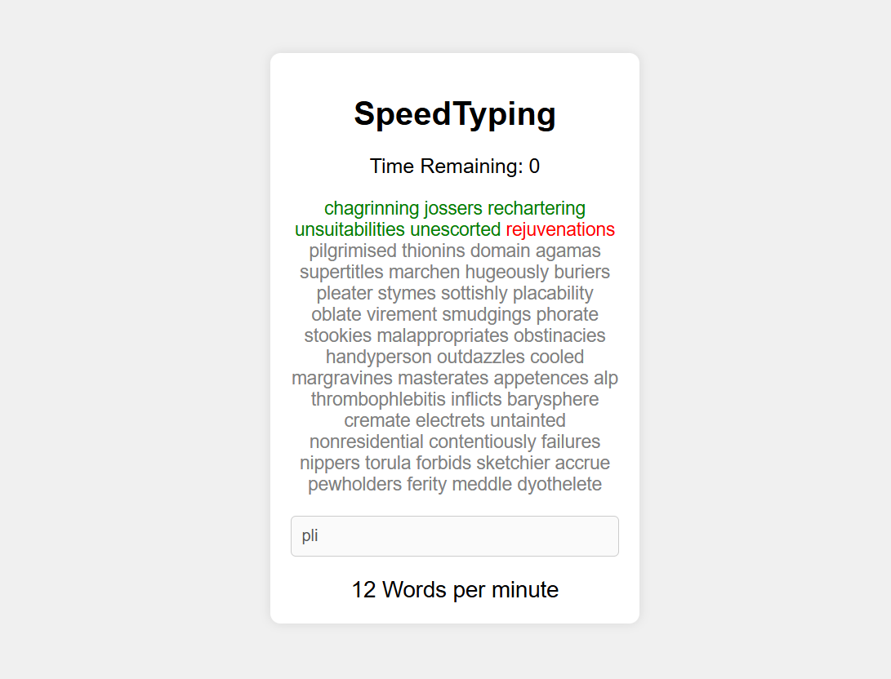

# Speedtype

## How It Works
1. The game starts as soon as you type the first word.
2. Words appear on the screen, and you need to type them in the input field.
3. The word changes color based on your input:
   - **Green** for correct typing.
   - **Red** for incorrect typing.
4. After 30 seconds, your typing speed is calculated in WPM and displayed on the screen.

